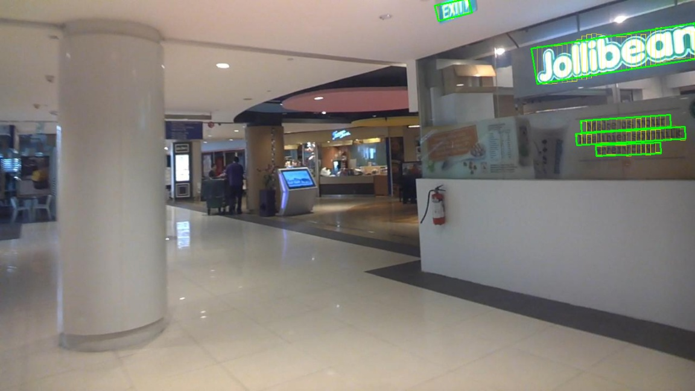
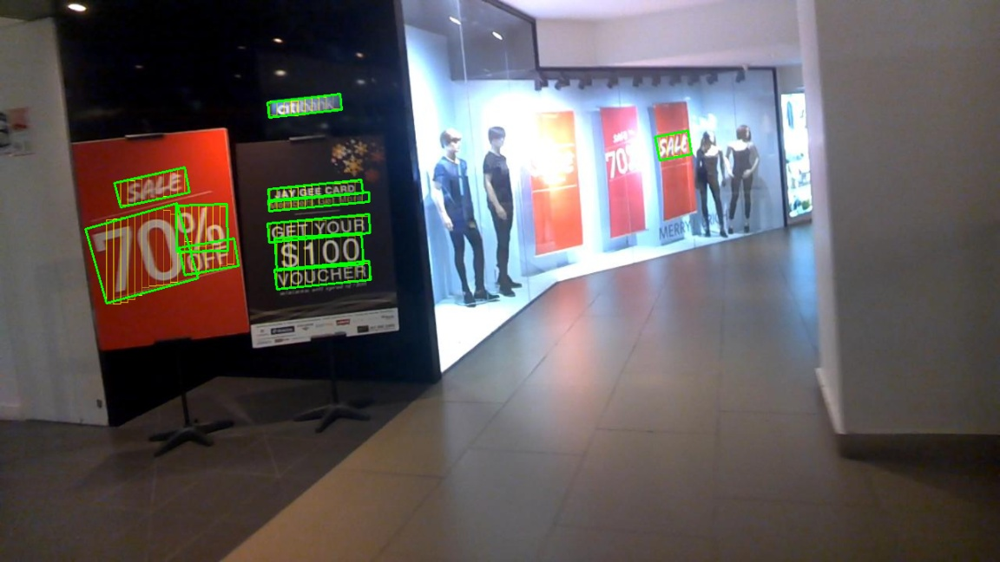
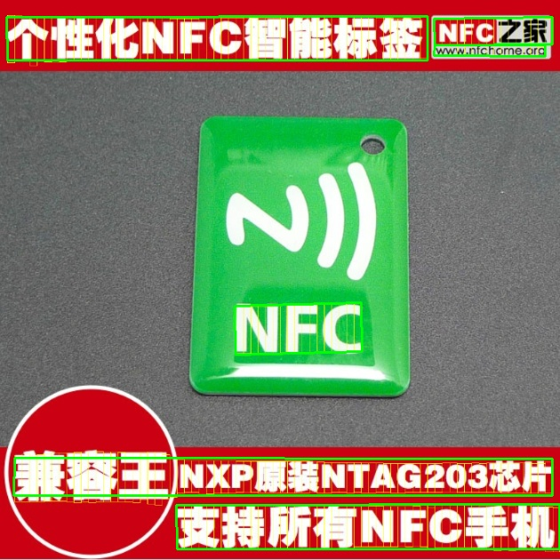
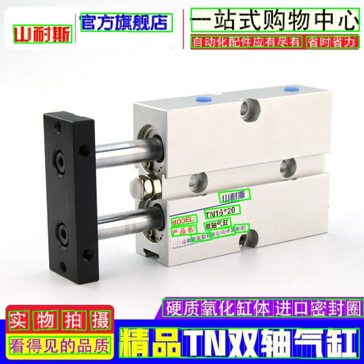
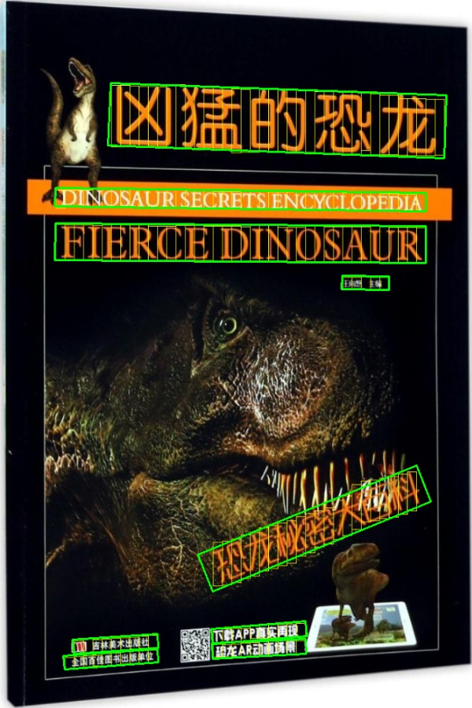
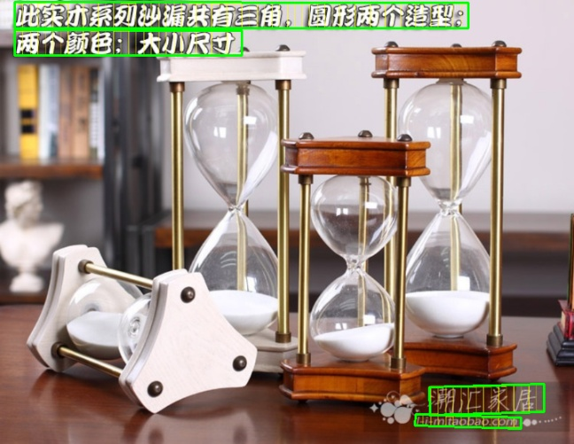
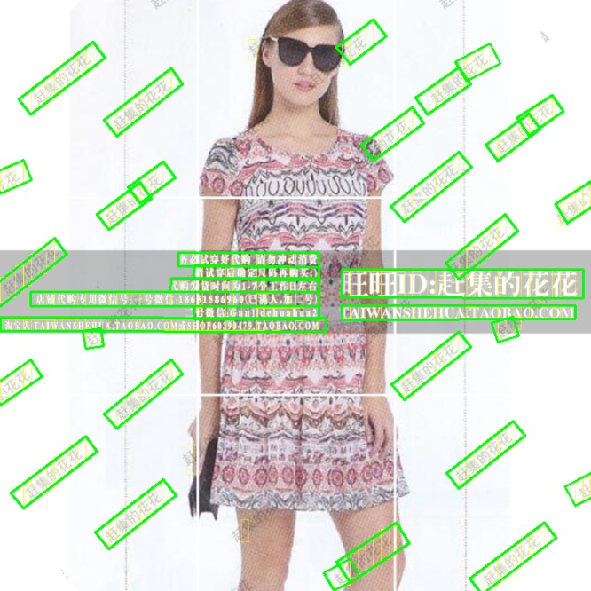

# text-detection-ctpn-pytorch


my blog about CTPN [blog](https://blog.csdn.net/fxwfxw7037681/article/details/103897907)

# Conlusion

Ctpn works better for horizontal text, but worse for oblique and curved text.If you are interested in text detection and model compression, 
you can pay attention to the two projects I will do next, [psenet](https://github.com/BADBADBADBOY/pse-lite.pytorch) and [DBNet](https://github.com/BADBADBADBOY/DBnet-lite.pytorch)

# setup
nms and bbox utils are written in cython, you have to build the library first.
```shell
cd utils/bbox
sh make.sh
```
It will generate a nms.so and a bbox.so in current folder.
***
# how to test
- follow setup to build the library 
- download the test model
- change you own model_path , dir_path and save_path in inference.py
```
python3 inference.py
```

#### test model

| base_model | Model_size(M) | model_file|
| - | - | - |
| vgg16_bn | 67.7 | [baiduyun](https://pan.baidu.com/s/12Oyew-ROVr5ipmvIovgeyA)(extract code: 5pgy) |
| resnet50 | 137 | [baiduyun](https://pan.baidu.com/s/12Oyew-ROVr5ipmvIovgeyA)(extract code: 5pgy) |
| shufflenet_v2_x1_0 | 25.4 | [baiduyun](https://pan.baidu.com/s/12Oyew-ROVr5ipmvIovgeyA) (extract code: 5pgy) |
| mobilenet_v3_large | 16.9 | [baiduyun](https://pan.baidu.com/s/12Oyew-ROVr5ipmvIovgeyA) (extract code: 5pgy) |
| mobilenet_v3_small | 13.5 | [baiduyun](https://pan.baidu.com/s/12Oyew-ROVr5ipmvIovgeyA) (extract code: 5pgy) |


***
# how to train
#### data format
follow icdar15 dataset format, x1,y1,x2,y2,x3,y3,x4,y4,label
```
image
│   1.jpg
│   2.jpg   
│		...
label
│   1.txt
│   2.txt
|		...
```

 
#### train 
Simplely run
```
python3 train.py --base_model vgg16_bn --batch_size 4 --size_list [1048]
```
***
#### Some explanations

1. Support switching basemodel,(mobilenet_v3_large,mobilenet_v3_small, shufflenet_v2_x1_0, shufflenet_v2_x0_5, vgg11, 
vgg11_bn, vgg16, vgg16_bn, vgg19, vgg19_bn, resnet18, resnet34 ,resnet50, resnet101, resnet152)
2. Ohem algorithm is added
3. Support batch training
4. When the size_list has multiple values, the maximum edge of the training picture will be randomly zoomed when training. 
It should be noted that you must ensure that your GPU memory supports maximum edge scaling.
***

# performance
##### only train on icdar2015

| rescall | prediction | hmean|
| - | - | - |
|  0.4058 |  0.6117| 0.4879|

## some results in icdar2015
     

***
## some results in MTWI2018
     
     
     
     
     
    


# reference

 1. https://github.com/eragonruan/text-detection-ctpn
 2. https://github.com/AstarLight/Lets_OCR/tree/master/detector/ctpn
 3. https://github.com/xhzdeng/stela
 4. https://github.com/xiaolai-sqlai/mobilenetv3

