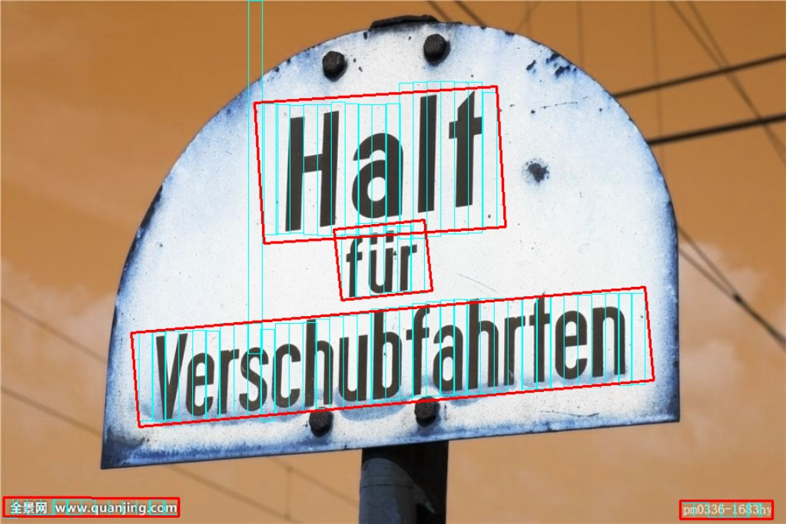
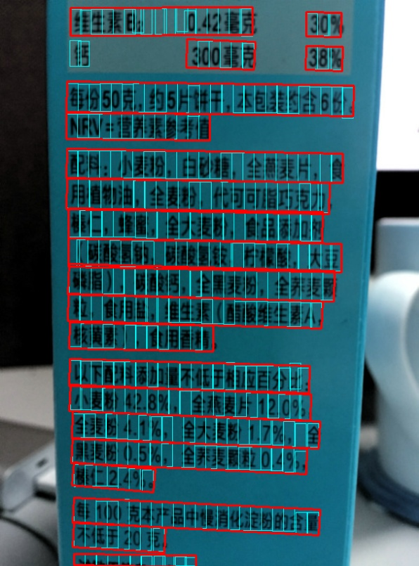
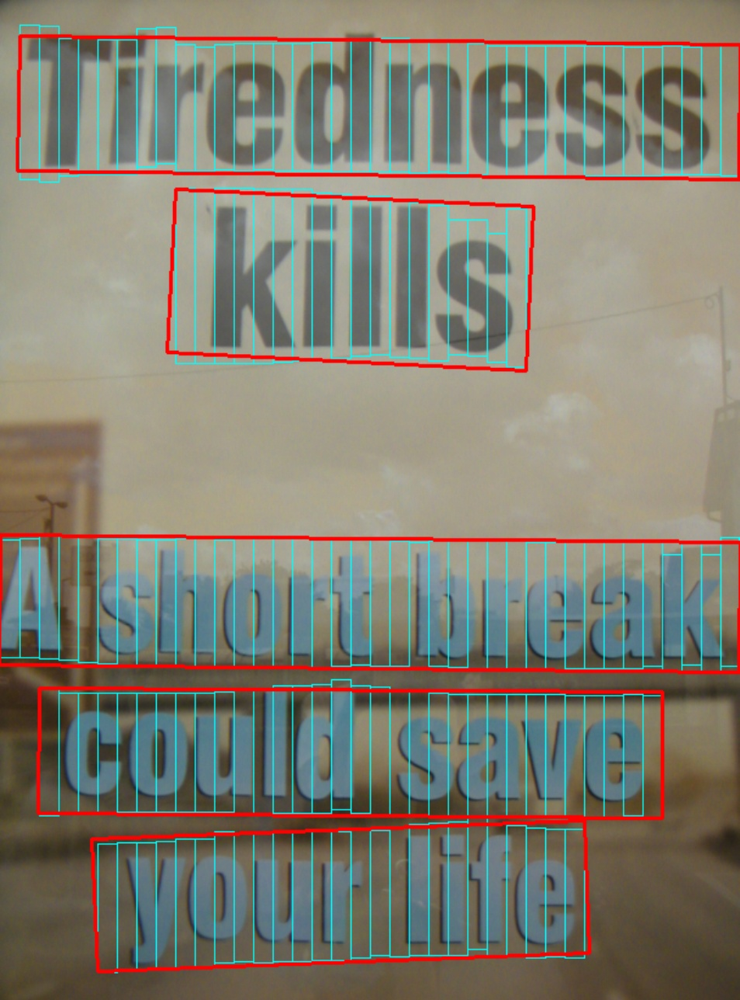
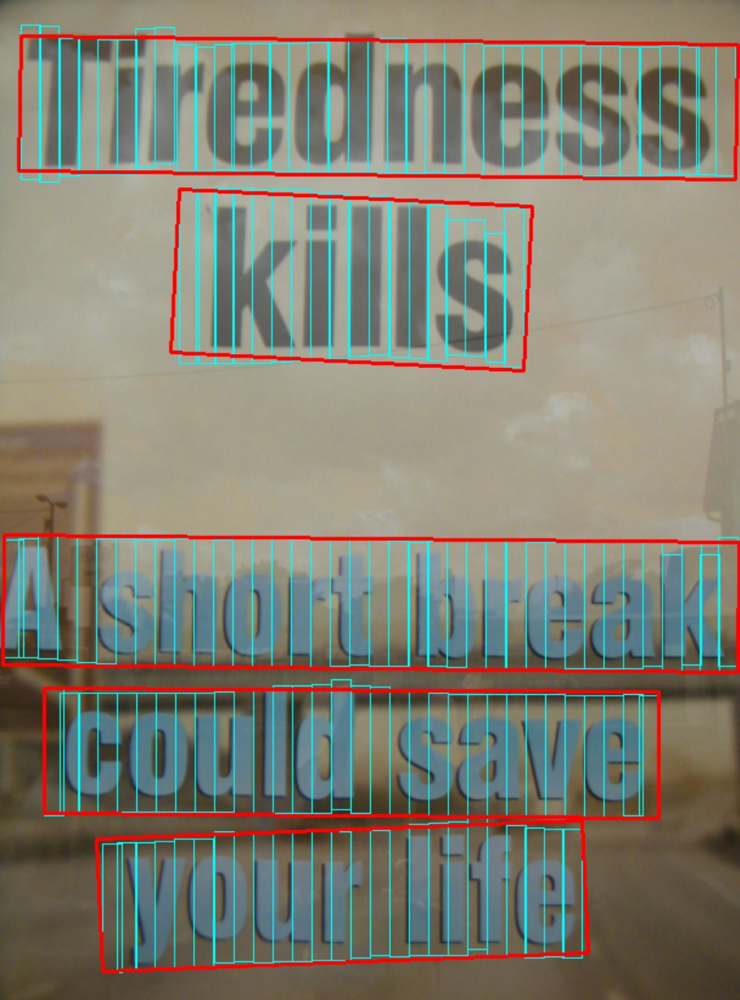
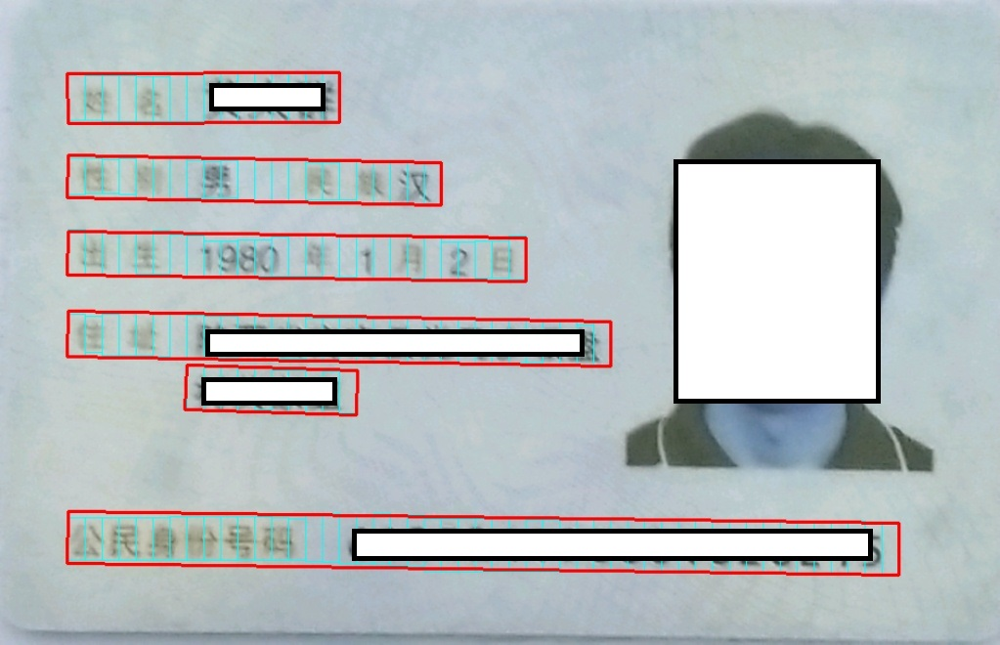
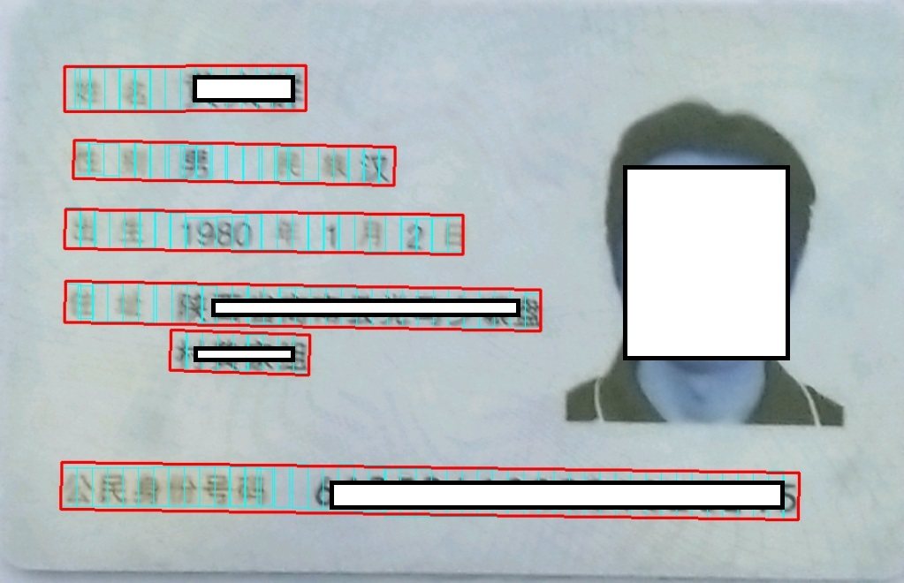

# text-detection-ctpn-pytorch


# setup
nms and bbox utils are written in cython, you have to build the library first.
```shell
cd utils/bbox
sh make.sh
```
It will generate a nms.so and a bbox.so in current folder.
***
# how to test
- follow setup to build the library 
- download the test model  from  [baidu yun](https://pan.baidu.com/s/17FlYxGhEVLbIWcgMeusJDg)
- change you own model_path , dir_path and save_path in inference.py
```
python3 inference.py
```
***
# how to train
####data format
follow icdar15 dataset format, x1,y1,x2,y2,x3,y3,x4,y4,label
```
image
│   1.jpg
│   2.jpg   
│		...
label
│   1.txt
│   2.txt
|		...
```

#### get pre_model
- First, download the pre-trained model from [torchvision.models.vgg](https://download.pytorch.org/models/vgg16-397923af.pth), put it in root_dir .
```
python3 get_premodel.py
```
it will generate the pre_model named "vgg16.model" in root_dir
***

then change you train data path in ./dataloader/data_provider.py , the train data path is  the root path of your image and label dir  


#### train 
Simplely run
```
python3 train.py
```
***
# some results
 

 

 

 

 

 

#reference

 1. https://github.com/eragonruan/text-detection-ctpn
 2. https://github.com/AstarLight/Lets_OCR/tree/master/detector/ctpn


